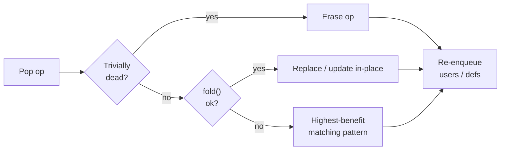

# MLIR `canonicalize` pass (`createCanonicalizerPass`)

| | |
|--|--|
| **Pass name** | `"canonicalize"` (`CanonicalizerPass`) |
| **Implementation** | LLVM/MLIR: `mlir/lib/Transforms/Canonicalizer.cpp` |
| **API** | `mlir/include/mlir/Transforms/Passes.h` → `createCanonicalizerPass(...)` |
| **Driver** | `mlir/lib/Transforms/Utils/GreedyPatternRewriteDriver.cpp` |
| **In Triton** | Used standalone (`passes.common.add_canonicalizer`) and embedded inside passes such as `OptimizeDotOperands` |

Upstream references:

- [Canonicalizer.cpp](https://github.com/llvm/llvm-project/blob/main/mlir/lib/Transforms/Canonicalizer.cpp)
- [Passes.td](https://github.com/llvm/llvm-project/blob/main/mlir/include/mlir/Transforms/Passes.td) (`CanonicalizerPass` options)
- [GreedyPatternRewriteDriver.h](https://github.com/llvm/llvm-project/blob/main/mlir/include/mlir/Transforms/GreedyPatternRewriteDriver.h)

---

## 1. General mechanism

The canonicalizer is MLIR’s **generic IR cleanup pass**. At startup it collects **canonicalization rewrite patterns** from every dialect and op already present in the `MLIRContext`, then repeatedly applies them with a **greedy worklist driver** until the IR reaches a fixpoint or a configured limit is hit. It is **not** domain-specific: it does not know about dots, TMA, or warp specialization. Its job is to fold redundant forms, push/sink layout converts, simplify control flow, and remove trivially dead ops so later passes see simpler def-use chains.

Each op visit also runs **`op->fold()`** (constant folding, identity transposes, no-op reshapes, etc.) before trying rewrite patterns. Canonicalization is **best-effort**: stopping after `max-iterations` is normal and not a pass failure unless `test-convergence` is enabled.

---

## 2. Workflow and loop control

### High-level flow

Three phases: **setup once**, then **outer iterations** each running an **inner worklist loop**.

```text
SETUP (once)
  └─ collect canonicalization patterns
       from every loaded dialect + registered op

OUTER LOOP  (i = 1 … maxIterations, default 10)
  │
  ├─ 1. Rebuild worklist     (top-down region walk by default)
  ├─ 2. Erase unreachable blocks
  │
  ├─ INNER LOOP  (until worklist empty or max-num-rewrites hit)
  │     repeat:  pop op  →  process op  →  re-enqueue affected ops
  │               see “Per-op pipeline” below
  │
  ├─ 3. Region simplification   (dead block args, CFG cleanup)
  ├─ 4. Optional CSE between iterations
  │
  └─ 5. Exit if IR unchanged (fixpoint)
        else if i < maxIterations → go to step 1
        else → stop best-effort (still success unless test-convergence)
```

**Per-op pipeline** (one worklist pop):



**Traversal note:** worklist seed order is **top-down** (preorder walk), not SSA def-use order. After each rewrite, affected ops are added dynamically.

### Two nested loops

| Loop | What it does | Default stop |
|------|----------------|--------------|
| **Outer** (`max-iterations`, default **10**) | Clear worklist, repopulate entire region, run inner loop + region simplify (+ optional CSE), repeat if anything changed | Fixpoint **or** iteration cap |
| **Inner** (worklist) | Pop one op at a time; fold / pattern-rewrite; enqueue users & modified ops | Worklist empty **or** `max-num-rewrites` (default **unlimited**) |

### Op processing order (not SSA order)

- Default **`top-down = true`**: preorder walk of the region, list reversed, then **pop from back** → roughly **top-down within blocks**.
- Alternative **`top-down = false`**: postorder (bottom-up); can match larger compound patterns in ambiguous cases, often slower.
- After a rewrite, **affected users/definers** are re-enqueued dynamically. Order is **not** fixed SSA def-use order.

### Pattern choice on one op

For each worklist op:

1. Erase if trivially dead.
2. Try **`fold()`** (skipped for constant-like ops to avoid infinite rematerialize loops).
3. **`PatternApplicator`**: among patterns that match this op, apply the one with **highest `PatternBenefit`** (default benefit = 1). One successful rewrite per visit; op may return to worklist.

### Pass options (`CanonicalizerPass` in `Passes.td`)

| Flag | Default | Role |
|------|---------|------|
| `top-down` | `true` | Worklist seed traversal order |
| `max-iterations` | `10` | Outer loop cap |
| `max-num-rewrites` | `-1` (no limit) | Inner loop cap per iteration |
| `region-simplify` | `normal` | Dead block args, CFG cleanup between iterations |
| `cse-between-iterations` | `false` | Full CSE between outer iterations |
| `test-convergence` | `false` | Fail pass if fixpoint not reached |
| `filter-dialects` | empty | Only collect patterns from listed dialect namespaces |

Plain `createCanonicalizerPass()` uses all defaults. Non-convergence does **not** fail the pass unless `test-convergence` is set.

### Controlling behavior in C++

```cpp
GreedyRewriteConfig config;
config.setMaxIterations(20);
config.setUseTopDownTraversal(true);
pm.addPass(mlir::createCanonicalizerPass(config));
```

Pattern-level filtering: `disabledPatterns` / `enabledPatterns` on `createCanonicalizerPass(config, disabled, enabled)` (match pattern debug labels).

---

## 3. Basic elements

### 3.1 Where patterns come from

The canonicalizer builds **one unified pattern set** from two sources:

```text
for each loaded dialect D:
    D->getCanonicalizationPatterns(patterns)

for each registered op O in the context:
    O.getCanonicalizationPatterns(patterns, context)
```

**Loaded dialect** = dialects already instantiated in the `MLIRContext` for this module (via op types, attributes, or `getDependentDialects` on passes). This is **not** every dialect linked into the binary.

**Registered op** = every op known to the context registry; ops can register patterns even if their dialect’s dialect-level hook is empty.

**Third-party / upstream dialects** commonly loaded during Triton ttgir lowering include:

| Dialect | Typical patterns / folds |
|---------|---------------------------|
| `arith` | Constant fold, `x+0`, `x*1`, compare folds |
| `scf` | `for`/`if` canonicalization, unused iter_args |
| `cf` | Branch simplification |
| `builtin` | Module/func cleanup via generic MLIR infra |
| `ub` | Poison/no-op folds (when present) |

Triton-specific dialects add the layout and tensor patterns most relevant to GPU IR (see §4).

### 3.2 Three rewrite mechanisms (often confused)

| Mechanism | Registered how | When it runs |
|-----------|------------------|--------------|
| **`OpFoldResult op->fold()`** | `hasFolder` / `fold()` on op class | Before patterns, on each worklist op |
| **Op-level canonicalization patterns** | `Op::getCanonicalizationPatterns` | Greedy pattern matcher |
| **Dialect-level canonicalization patterns** | `Dialect::getCanonicalizationPatterns` | Same pattern pool (e.g. all of `arith`) |

Folds are **local algebraic simplifications** on a single op. Rewrite patterns can **replace subgraphs** (e.g. `cvt(cvt(x)) → cvt(x)`).

### 3.3 What the canonicalizer does *not* include

- Pass-specific patterns added manually (e.g. `SwizzleShmemConvert` in `OptimizeDotOperands`) — those run in a **separate** `applyPatternsGreedily` unless explicitly added to the canonicalizer’s pattern set.
- Cross-pass analyses (alias, membar, layout assignment).
- Guaranteed full canonical form: iteration limits and pattern interaction mean cleanup can stop early.

---

## 4. Example illustrations

### 4.1 `ttg.convert_layout` — op-registered patterns (TritonGPU)

Defined in `lib/Dialect/TritonGPU/IR/Ops.cpp` → `ConvertLayoutOp::getCanonicalizationPatterns`.

Theme: **eliminate redundant layout hops** and **sink converts toward producers/consumers**.

| Pattern | Before → after (schematic) |
|---------|----------------------------|
| `CanonicalizeConvertFromConvert` | `cvt(cvt(x)) → cvt(x)` |
| same | `cvt(x) → x` when src/dst types identical |
| same | `cvt(local_load(m)) → local_load(m, dstLayout)` |
| same | `cvt(splat(v)) → splat(v, dstLayout)` |
| same | `cvt(const) → const` with splat attribute reshaped |
| `CanonicalizeConvertFromTranspose` | `trans(cvt(x)) → trans(x)` when cvt trivial |
| `CanonicalizeConvertFromAlloc` | `local_alloc(cvt(x)) → local_alloc(x)` |
| `CanonicalizeConvertFromLocalStore` | `local_store(cvt(x), m) → local_store(x, m)` |
| `CanonicalizeConvertFromReshape` | `reshape(cvt(x)) → reshape(x)` when cheap |

**Intentional non-fold:** `CanonicalizeConvertFromConvert` **refuses** `NvidiaMmaEncoding → DotOperandEncoding` converts (fused-attention heuristic) so a later pass can still see them.

**Why it matters for dot pipelines:** pipelining and warp specialization insert extra `convert_layout` around `local_load` and dot operands. Canonicalizer collapses those chains so `OptimizeDotOperands` matchers see `dot ← cvt ← trans ← …` instead of `dot ← cvt ← cvt ← trans ← cvt ← …`.

### 4.2 `tt.trans` — fold + pattern interaction (Triton)

`TransOp::fold()` in `lib/Dialect/Triton/IR/Ops.cpp`:

- Identity order → return `src` (when types match).
- `trans(trans(x))` → single `trans` with composed order.
- Splat constant → reshaped splat attribute.

If layout differs on identity transpose, **`CanonicalizeConvertFromTranspose`** may insert a **trivial** `convert_layout` instead of folding away — fold and patterns cooperate across iterations.

### 4.3 `arith` dialect — loaded third-party patterns

Example folds (conceptual):

```mlir
%0 = arith.addi %a, %c0 : i32    →  %a
%1 = arith.muli %b, %c1 : i32    →  %b
%2 = arith.constant 4 : i32      →  folded into users / CSE'd
```

These run interleaved with Triton patterns on the same worklist. Pipelined kernels accumulate index arithmetic and loop bounds; arith/scf canonicalization keeps predicate and induction scaffolding small.

### 4.4 `scf.for` / `scf.if` — control-flow canonicalization

Between outer iterations, **region simplification** (`region-simplify = normal`) removes unused block arguments, simplifies yields, and cleans unreachable blocks. Together with scf dialect patterns, this matters after passes that clone loop bodies (software pipelining, warp specialization).

### 4.5 Triton usage: `OptimizeDotOperands`

`lib/Dialect/TritonGPU/Transforms/OptimizeDotOperands.cpp`:

```cpp
pm.addPass(mlir::createCanonicalizerPass());   // full MLIR canonicalizer (§1–3)
// ...
patterns.add<SwizzleShmemConvert, FuseTransMMAV3Plus, ...>();  // dot-specific
ConvertLayoutOp::getCanonicalizationPatterns(patterns, context); // subset re-run
applyPatternsGreedily(m, std::move(patterns));
```

**Two-stage design:**

1. **Canonicalizer pass** — broad cleanup across all loaded dialects.
2. **Targeted greedy pass** — only dot-operand patterns + `ConvertLayoutOp` patterns again (catches converts introduced by stage 2).

In `third_party/nvidia/backend/compiler.py`, `passes.common.add_canonicalizer(pm)` also runs at pipeline boundaries (e.g. after pipelining, before the second `add_optimize_dot_operands` on SM100+).

---

## 5. Quick reference checklist

When reading or debugging canonicalizer behavior:

1. **Which dialects are loaded?** → determines pattern pool size.
2. **Outer vs inner loop** → fixpoint vs `max-iterations` early exit.
3. **Worklist order** → top-down traversal, not SSA order.
4. **Per op: dead → fold → highest-benefit pattern** → one rewrite at a time.
5. **Folds vs patterns** → `trans(trans(x))` may fold; `cvt(cvt(x))` needs a rewrite pattern.
6. **Embedded vs standalone** → same MLIR pass; surrounding pass may add extra greedy rounds with a custom pattern set.
